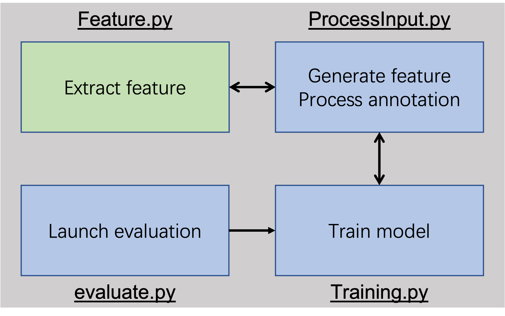

# AutoSegmentation
Creating a music/nonmusic classifier for auto-segmentation of All-State Band audition recordings.

The goal is to automatically locate the timestamps for the beginning and ending of each of the 5 all state audition exercises.

Use overview:

As a user you will use the main.py script. There is a wrapper function written in main.py that encapsulates two primary functions for one continuous process. This is the easiest way to process new data as the scripts are intended to be primarily used for. This function is called annotateNewData() and has the following parameters:

    - audioDirectory: the directory of the raw mp3 files

    - writeAddress: the location where the text files should be written to

    - modelPath: the path to the model that will be used for the classification SVM
    
    - fileList: the array of student ID integers that you would like to run from the directory. If left blank, all files will be run.

    - generateDataReport: a boolean that allows user to specify if they would like a dataReport text file to be automatically generated detailing information about the classification process

    - keepNPZFiles: a boolean that allows user to specify if they would like to keep the npz files in the directory, or automatically delete them upon completion of the classification process.

    - numberOfMusicalExercises: the number of musical exercises, defaults to 5 which is the historical number of exercises but if it changes in the future this will need to be changed for successful classifications.
    
    
If you would like to use these steps individually for any particular reason they are broken up as follows:

1. The writing of numpy feature matrices for each audition file to be written to individual NPZ files

    This is done by calling writeFeatureData() and the input parameters are as follows:
    
        - audioDirectory: the directory path in which the audio files are located. The standard organization is that each mp3 file will be enclosed in a folder with that audition number. 
          
          ex. a directory with 3 auditions would have 3 folders named 83123, 84562, and 87654. Each of these folders would contain the respective
          mp3 files 83123.mp3, 84562.mp3, and 87654.mp3.
          
        - textDirectory: this is the directory of pregenerated text files for annotated data. If this function is processing new data, this parameter should be left blank to default to an empty string.
     
        - writeDirectory: this is the directory to which the npz files will be written to
        
        - fileList: the array of student ID integers that you would like to run from the directory. If left blank, all files will be run.
     
        - writeFiles: gives the option to not write the npz files if the function is only being used to learn something about the data set but not continue with the standard process.
     
        - newData: this parameter defaults to true, but if this function is being used with annotated data, then set this to False to indicate that the groundTruth annotation data should be processed and included in the npz file.

  2. The classification of these npz files generated in step one using classifyFeatureData() with these input parameters:
  
         - directory: the path to the directory of npz files for classification
         
         - writeAddress: the location to write the output annotation text files to
         
         - modelPath: the path to the model that will be used for the classification SVM
         
         - generateDataReport: a boolean that allows user to specify if they would like a dataReport text file to be automatically generated detailing information about the classification process
         
         - keepNPZFiles: a boolean that allows user to specify if they would like to keep the npz files in the directory, or automatically delete them upon completion of the classification process.
         
         - numberOfMusicalExercises: the number of musical exercises, defaults to 5 which is the historical number of exercises but if it changes in the future this will need to be changed for successful classifications.
         
 
# Update 09/26/2022
Code revived!

## Installation
Run the command below to install the required packages

```conda create --name <name> --file requirements.txt```

## Inference

`annotate_new_data.py` does inference on new audio data using the trained model.

<div style="text-align:center"></div>

Usage:

```python annotate_new_data.py -i <input_audio_dir> -o <output_dir> -m <model_path>```
- `input_audio_dir` is the directory containing `stu_id/stu_id.mp3` files
- `output_dir` is the directory to write the report and the output
- `model_path` is the path of trained svm model

## Training

`train_svm.py` trains a new svm model using the data.

<div style="text-align:center"></div>

Usage:

```python train_svm.py -i <input_training_audio_dir> -o <output_dir> -n <model_name> -gt <ground_truth_dir> --isAudio```
- `input_training_audio_dir` is the directory containing `stu_id/stu_id.mp3` files used to train
- `output_dir` is the directory to output the trained model
- `model_name` is the name of model in the `output_dir`
- `ground_truth_dir` is the directory containing `stu_id.txt` ground truth segmentation (can be ignored if using `.npz` feature and ground truth data)
- disable `isAudio` if using the `.npz` files instead of raw audio.

## Evaluation
**Please don't do this. It is still messy.** `evaluate.py` evaluates the trained svm model.

<div style="text-align:center"></div>


Usage:

```python evaluate.py -i <input_feature_dir> -o <output_dir> -m <model_path>```
- `input_feature_dir` is the directory containing `stu_id.npz` files. Notice that the `.npz` file should contain both feature and groundtruth
- `output_dir` is the directory to output the report (not working, don't know why)
- `model_path` is the path of the svm model to test